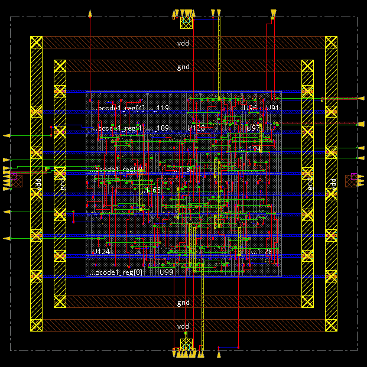
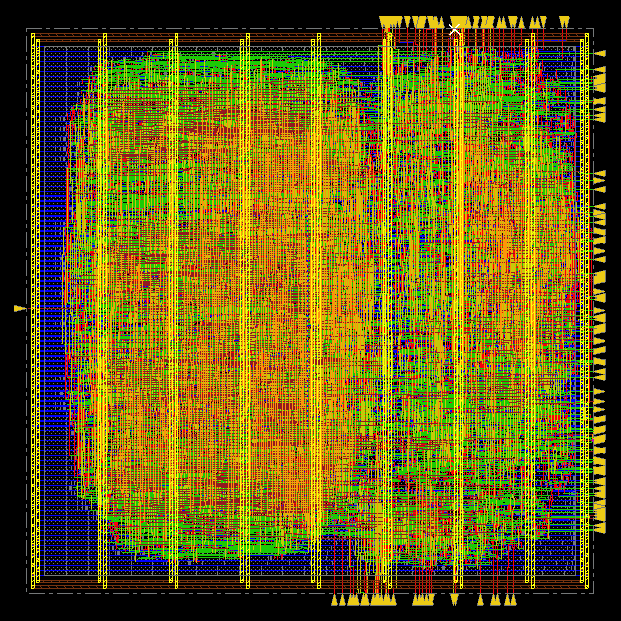

# 32-bit 5-Stage Pipelined RISC (DLX) Processor

> **Note:** Due to academic policy, the VHDL source code for this project is not public. This repository documents the architecture, design flow, and final implementation results.

This project, completed for the Microelectronic Systems course at Politecnico di Torino, involved the top-down design and implementation of a 32-bit, 5-stage pipelined RISC (DLX) processor, from RTL design in VHDL to post-routing physical layout.

---

## Core Design Flow & Tools

The entire RTL-to-GDS flow was implemented using industry-standard EDA tools:

1.  **RTL Simulation & Verification:**
    * Used **Questa Sim** to verify the functional correctness of the VHDL modules.
    * Testbenches covered data hazards (stalls), forwarding logic, and branch handling.

2.  **Synthesis (RTL-to-Gate):**
    *  Used **Synopsys Design Compiler** to synthesize the design from VHDL into a gate-level netlist.
    *  The process was optimized for timing, power, and area under multiple clock constraints.

3.  **Physical Design (P&R):**
    *  Used **Cadence Innovus** for the complete physical implementation flow.
    *  This included floorplanning, power planning, placement, Clock Tree Synthesis (CTS), and final routing.

---

## Key Results

The design successfully met all performance targets after full implementation.

* **Final Layout:** 

    **Control unit**

    **Datapath**

* **Timing Closure:** Achieved final timing closure post-routing, meeting all setup and hold constraints. 
    * **Worst Negative Slack (WNS): 0.917 ns** (This positive value confirms all setup timing was met).

## Project Documentation & Results

For a complete analysis of the architecture, design choices, verification strategy, and in-depth synthesis/P&R results, see the full technical report. The presentation slides provide a high-level summary.

* [**View the Full Technical Report (DLX_Complete_Report.pdf)**](./DLX_Complete_Report.pdf)
* [**View the Final Presentation (DLX_Presentation.pdf)**](./DLX_Presentation.pdf)